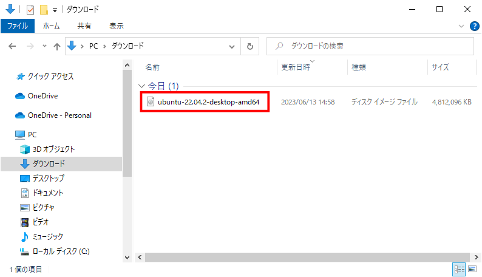
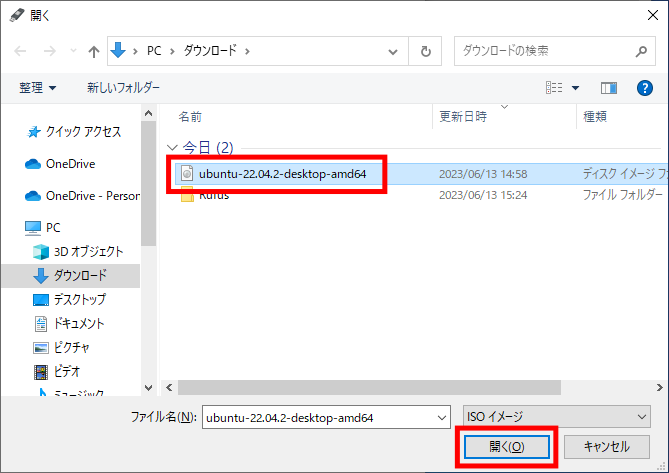
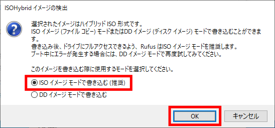
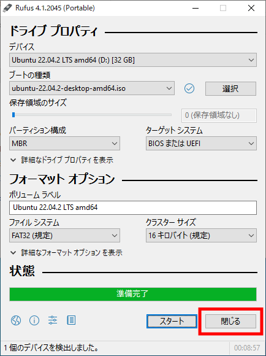
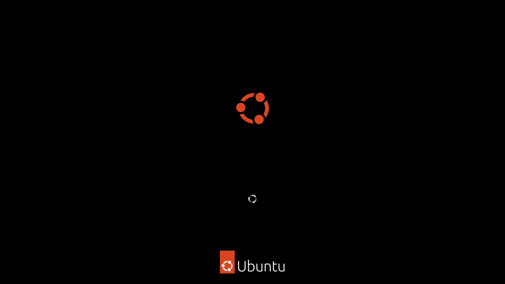

============================================================
Linuxのインストール（PC）
============================================================

Linuxはオープンソースのオペレーティングシステム（OS）です。

PCにはUbuntu Desktop 22.04 LTSをインストールします。

Linuxのダウンロード
============================================================

Ubuntu Desktop 22.04 LTSのディスクイメージを `UbuntuのHP <https://releases.ubuntu.com/22.04/>`_ からダウンロードします。

|

ダウンロードフォルダに保存されます。

|

Rufusのダウンロード
============================================================

Rufus（ルーファス）は起動可能なUSBフラッシュドライブを作成することができるソフトウェアです。

Rufusを `RufusのHP <http://rufus.ie/ja/>`_ からダウンロードします。

|

Portableをダウンロードしてください。

.. image:: ./img/rufus_download_img_02.png
   :width: 800px
   :align: center

|

ダウンロードフォルダに保存されます。

|

Live USBの作成
============================================================

ダウンロードしたRufusをダブルクリックすると、Rufusが起動します。

［選択］ボタンをクリックしてください。

.. image:: ./img/live_usb_img_01.png
   :align: center

|

Ubuntuのイメージディスクファイルを選択します。

|

［スタート］ボタンをクリックしてください。

.. image:: ./img/live_usb_img_03.png
   :align: center

|

［OK］ボタンをクリックしてください。

|

［はい］ボタンをクリックしてください。

.. image:: ./img/live_usb_img_05.png
   :align: center

|

［OK］ボタンをクリックしてください。

.. image:: ./img/live_usb_img_06.png
   :align: center

|

インストールメディアの作成中。

|

［閉じる］ボタンをクリックしてください。

|

Linuxのインストール
============================================================

Live USBをPCに挿入してください。

PCの電源ボタンを押したら、［F12］キーを連打し、Boot Optionsの画面を表示させてください。

|

［↑］と［↓］を使ってUSB Storagr Deviceを選択し、［Enter］を押してください。

.. image:: ./img/linux_install_img_02.png
   :width: 800px
   :align: center

|

Try or Install Ubuntuが選択されていることを確認し、［Enter］を押してください。

|

しばらく待つ。

|

もう少し待つ。

.. image:: ./img/linux_install_img_05.png
   :width: 800px
   :align: center

|

Welcomeは、「English」が選択されいることを確認し、［Install Ubuntu］ボタンをクリックしてください。

.. image:: ./img/linux_install_img_06.png
   :width: 800px
   :align: center

|

Keyboard layoutは、「Japanese」−「Japanese」を選択し、［Continue］ボタンをクリックしてください。

Linux Install 5

Updates and other softwareは、デフォルトのまま ［Continue］ボタンをクリックする。
※有線LANを接続していないと、Wirelessの設定画面が出てくる。

Linux Install 6

Installation typeは、 ［Erase Ubuntu 20.04.2 LTS and reinstall］を選択し ［Install Now］ボタンをクリックする。
※違う画面が出てくるかもしれない。 →［Erase disk and install Ubuntu］を選択

Linux Install 7

Write the changes to disks?ウィンドウが表示されたら ［Continue］ボタンをクリックする。

Linux Install 8

Where are you?は、［Tokyo］が選択されていることを確認したら ［Continue］ボタンをクリックする。

Linux Install 9

Who are you?は、次の通り入力する。

Your name: ubuntu
Your computer's name: mbc***
Pick a username: ubuntu
Choose a password: hirate2020
Confirm your password: hirate2020
Require my password to login: Require my password to log in にチェック

入力できたら［Continue］ボタンをクリックする。

Linux Install 10

インストールが始まる。

Linux Install 11

インストールが終了すると、 Installation Completeウィンドウが表示されるので ［Restart Now］ボタンをクリックする。

Linux Install 12

Please remove the installation medium, then press ENTER というメッセージが表示されるので Live DVDを取り出して［Enter］を押す。

Linux Install 13

Linuxへのログイン
============================================================

ログイン画面が表示されたら、 パスワードを入力してログインする。

Linux Login 1

はじめに、各種設定の画面が表示されるが、 全てデフォルトのままとする。
Connect Your Online Accountsは、 ［Skip］ボタンをクリック。

Linux Login 2

Livepatchは、 デフォルトのまま［Next］ボタンをクリック。

Linux Login 3

Help improve Ubuntuは、 デフォルトのまま［Next］ボタンをクリック。

Linux Login 4

Privacyは、 デフォルトのまま［Next］ボタンをクリック。

Linux Login 5

You're ready to go!は、 ［Done］ボタンをクリック。

Linux Login 6

Software Updaterが出てきたら、 ［Install Now］ボタンをクリック。

Linux Login 7

パスワードを入力する。

Linux Login 8

アップデート中。

Linux Login 9

アップデートが終了したら、 ［Restart Now］をクリックして再起動する。

Linux Login 10

Linuxの日本語化
============================================================

左下のワッフルメニューをクリックして、アプリケーションを表示する。
[Settings]をクリックする。

Linux Japanese 1

[Settings]が起動する。

Linux Japanese 2

[Region & Language]を選択し、[Manage Installed Languages]をクリックする。

Linux Japanese 3

[Install]をクリックする。
ここでパスワードの入力を求められるので、パスワードを入力する。

Linux Japanese 4

変更の適用中。

Linux Japanese 6

[Language]に日本語（まだグレー）があることを確認したら、[Close]をクリックする。

Linux Japanese 7

[Language]をクリックする。

Linux Japanese 8

[日本語]を選択して、[Select]をクリックする。

Linux Japanese 9

[Restart]をクリックして、再起動する。
実際はログアウトするだけなので、再度ログインする。

Linux Japanese 10

再起動すると次のウィンドウが出てくるので、
[次回から表示しない]にチェックをして、
[古い名前のままにする]をクリックする。

Linux Japanese 11

表示が日本語化された。
再度Settingsを起動して、[地域と言語]をクリックする。
[入力ソース]の下の[+]をクリックする。

Linux Japanese 12

[日本語]をクリックする。

Linux Japanese 13

[日本語(Mozc)]を選択して、[追加]をクリックする。

Linux Japanese 14

[入力ソース]に[日本語(Mozc)]が追加された。

Linux Japanese 15

これで日本語を入力することができるようになりました。
日本語と英語の切り替えは、[Windows] + [Space] で行います。
